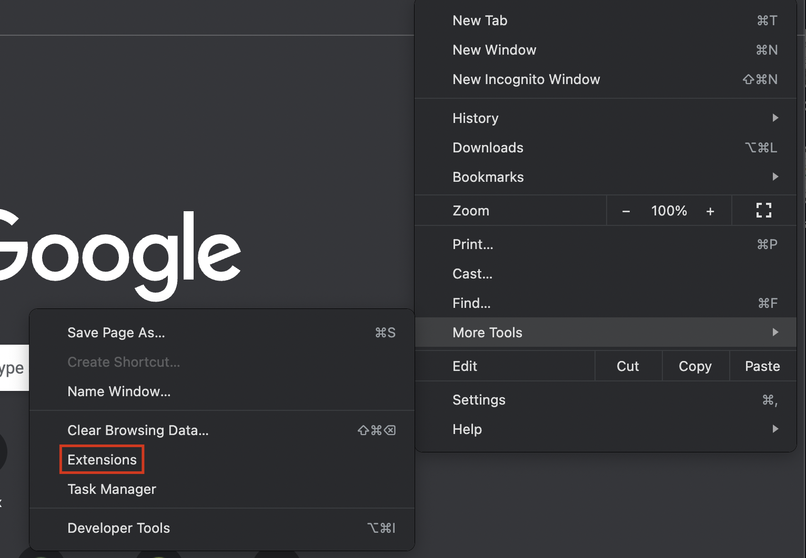

# Inclusivity Checker: A Testing Tool to Detect Inclusivity Bugs in Websites

At the current speed of technological advancement, particularly
with the pandemic driving the shift from physical to virtual, everyone must have access to the digital world. Guidelines for accessible
technology exist to assist software engineers in creating websites
accessible to disabled populations but are extensive and, therefore,
difficult to follow completely. Additionally, no standard guidelines
are available to address a wider range of human diversity beyond
disabilities. In this paper, we present a browser extension tool, Inclusivity Checker, that can assist in building more inclusive websites
by performing tests on checkpoints categorized into various user
groups based on disability type and diversity parameters. These checkpoints are based on existing guidelines and present developers with errors, warnings, and tips. To gauge the efficiency of the
developed tool, we evaluated the results manually. Furthermore, we
collected the developers’ feedback on the tool to test its usability.

## How do I run this tool?

`Note : This tool is only supported on chromium based browsers`

* Download the dist zip from [here](https://drive.google.com/file/d/19_W0btN2tnF7MJu1FS8LldfxX3gp205b/view?usp=share_link) and extract it anywhere on your device.

* Enable developer mode for chrome or chromium based browser. You may find it under `Extensions`. See screenshot below.

* Switch ON the developer mode and click on Load unpacked. See below.

* Navigate to the extracted dist folder and open the directory.

* You shall now see Inclusivity Checker installed in your browser.

* Open and try out the different areas of disability based detections!.

